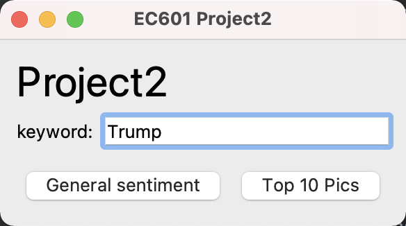
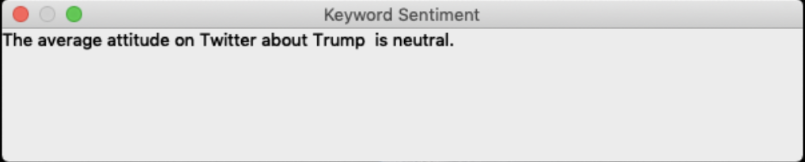

### Mission

The product allows political teams, sponsors and members of the public to retrieve tweets and analyze their mood by using Twitter API and Goggle NLP. It can tell how citizens react to a politician's speech or policy. So the users can adjust political strategy in time.

### User

Sponsors

Advisers

Team of politicians

The public

### User Stories

As a sponsor, I can search for the public's attitude toward a politician and decide whether to fund that politician.

As a adviser, I can gauge the public's acceptance of policies to advise political parties.

As a team of politician, we can read what people are saying about politicians on Twitter and analyze their attitudes. It helps us better plan the political‘s politicians' political speeches.

As the public, I can get the information about other people's atttitude towards politicians more effectively.

### MVP

Retrieving specific politicians or policies.

Analyze the sentiment of tweets.

Mark the retrieved content.
## Testing:

